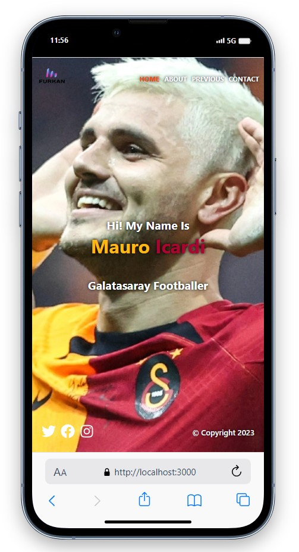
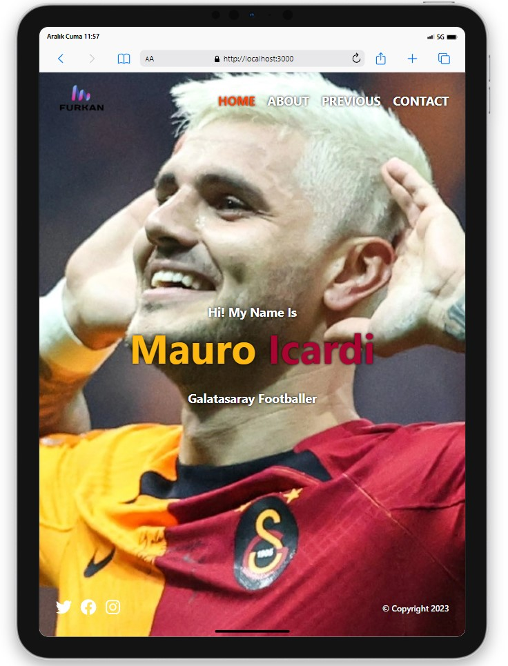
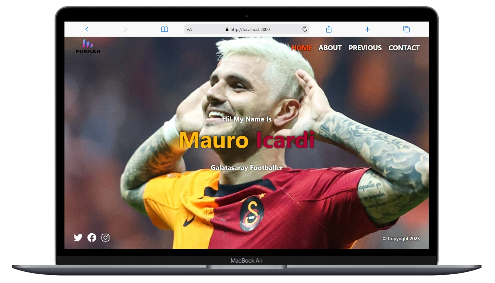

# Icardi Portfolio

<div align="center">
  
</div>

## About the Project

This is a portfolio page I created using React, dedicated to Galatasaray football player Mauro Icardi. This project features swift page transitions, detailed information about past clubs, and a responsive design to ensure a seamless user experience.

## Live Demo

[Icardi Portfolio](https://icardi-portfolio.vercel.app/)


## Technologies Used

- React
- React Router DOM
- Icons from [React Icons](https://react-icons.github.io/react-icons/)
- Styling with Sass

## Project Skeleton

```
Icardi Portfolio (folder)
|
|----readme.md         
SOLUTION
├── public
│     └── index.html
├── src
│   ├── App.js
│   ├── App.scss
│   ├── assets
│   │   └── [Images]
│   ├── components
│   │   ├── Error
│   │   │   ├── NotFound.css
│   │   │   └── NotFound.jsx
│   │   ├── Footer
│   │   │   ├── Footer.jsx
│   │   │   └── Footer.scss
│   │   └── Navbar
│   │       ├── Navbar.jsx
│   │       └── Navbar.scss     
│   ├── helper
│   │   └── data.js
│   ├── index.js
│   ├── pages
│   │   ├── about
│   │   │   ├── About.jsx
│   │   │   └── About.scss
│   │   ├── contact
│   │   │   ├── Contact.jsx
│   │   │   └── Contact.scss
│   │   ├── home
│   │   │   ├── Home.jsx
│   │   │   └── Home.scss
│   │   ├── previous
│   │   │   ├── Previous.jsx
│   │   │   └── Previous.scss
│   │   └── previousDetail
│   │       ├── PreviousDetail.jsx
│   │       └── PreviousDetail.scss
│   ├── router
│   │   └── router.js
│   └── scss
│       ├── _mixins.scss
│       ├── _reset.scss
│       └── _variables.scss
├── package.json
└── yarn.lock
```

## Screenshots

<div align="center">
  
  
  
</div>

## Compatibility

The project is compatible with both wide-screen computers and mobile devices.